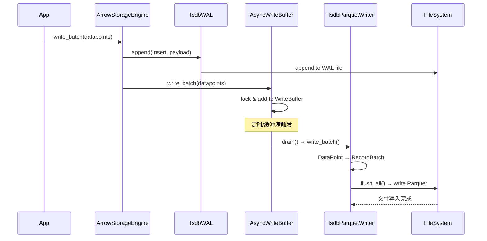
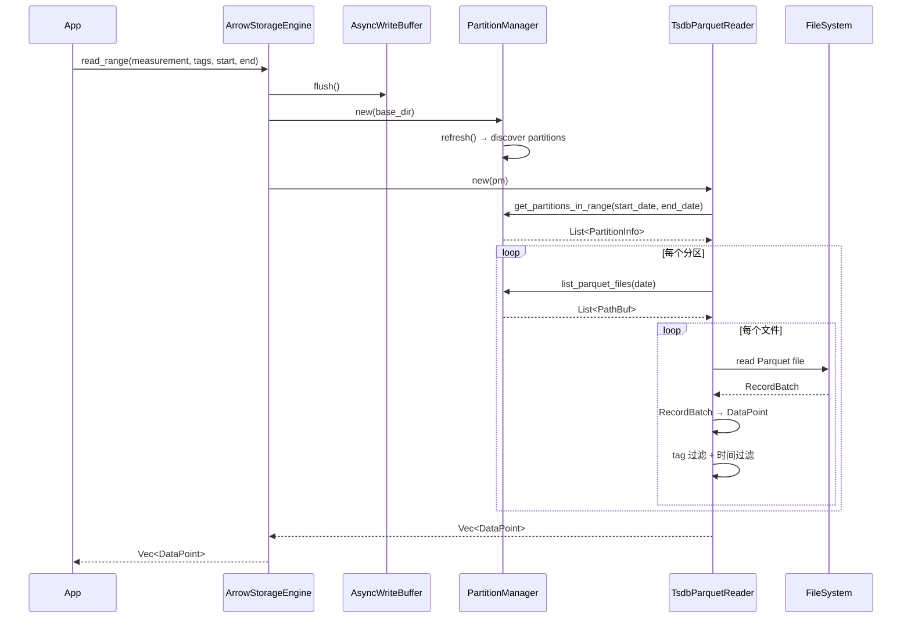
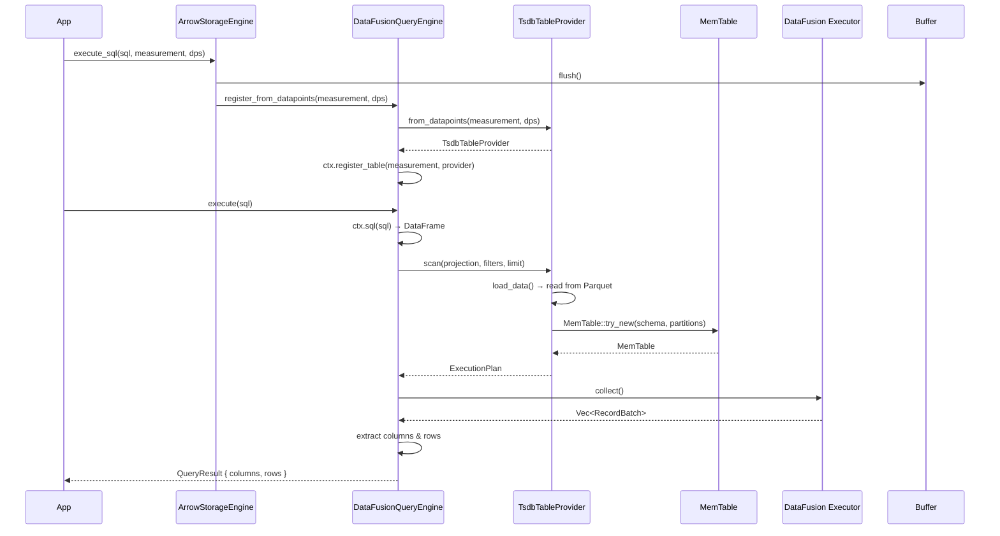
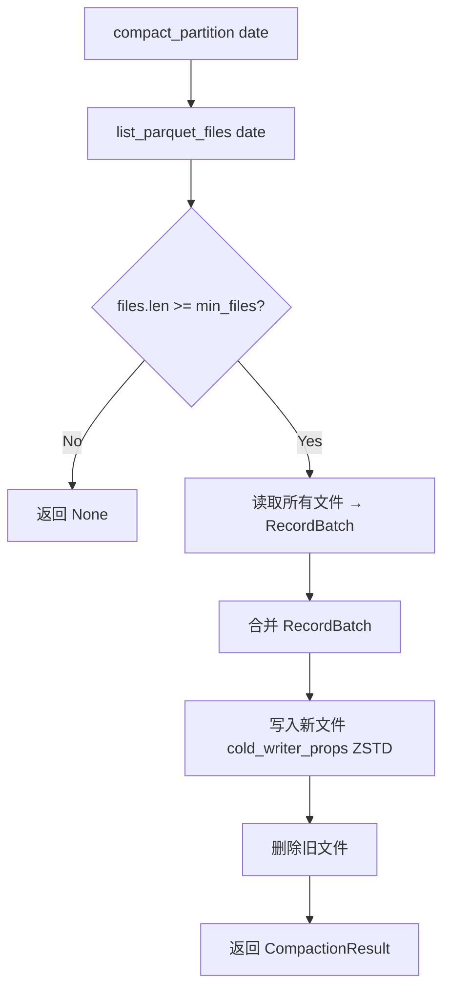
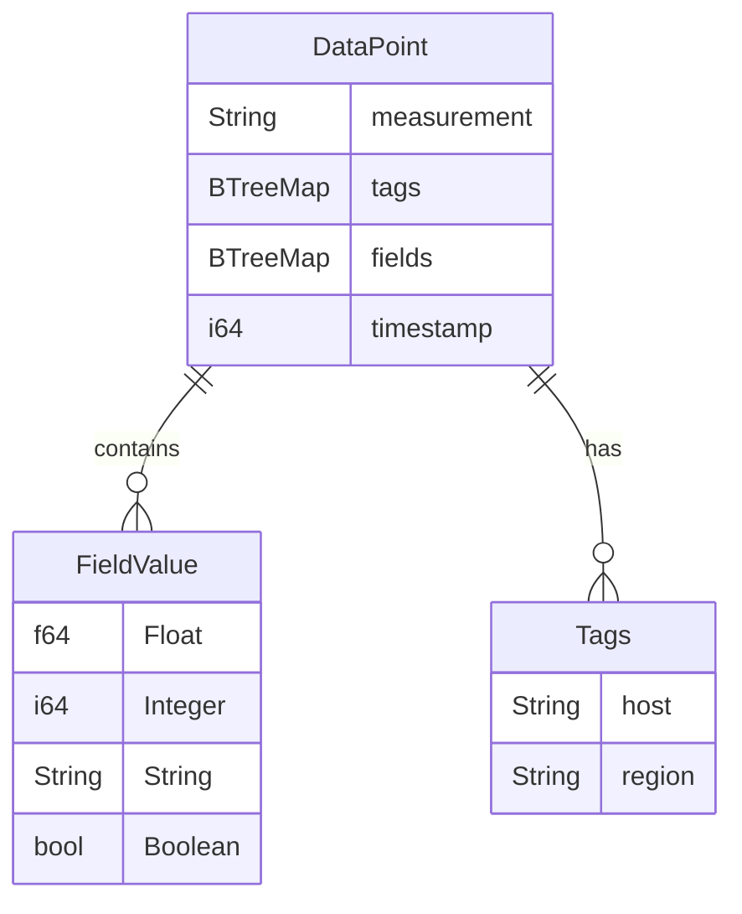

# tsdb2 技术架构文档

## 1. 系统架构图

```
┌──────────────────────────────────────────────────┐
│                 Application                       │
├──────────────────────────────────────────────────┤
│           ArrowStorageEngine (统一入口)            │
│  ┌──────────┬──────────────┬──────────────────┐  │
│  │  write() │  read_range()│  execute_sql()   │  │
│  └────┬─────┴──────┬───────┴────────┬─────────┘  │
├───────┼────────────┼────────────────┼────────────┤
│       ▼            ▼                ▼            │
│  ┌─────────┐  ┌──────────┐  ┌───────────────┐   │
│  │AsyncBuf │  │ Parquet  │  │ DataFusion    │   │
│  │ + WAL   │  │ Reader   │  │ Engine        │   │
│  └────┬────┘  └────┬─────┘  └───────┬───────┘   │
│       ▼            ▼                ▼            │
│  ┌─────────┐  ┌──────────┐  ┌───────────────┐   │
│  │ Parquet │  │ Partition│  │ TableProvider │   │
│  │ Writer  │  │ Manager  │  │ + UDF         │   │
│  └─────────┘  └──────────┘  └───────────────┘   │
├──────────────────────────────────────────────────┤
│              tsdb-arrow (数据模型)                 │
│  DataPoint | FieldValue | Schema | Converter     │
├──────────────────────────────────────────────────┤
│         Arrow | Parquet | DataFusion             │
└──────────────────────────────────────────────────┘
```

## 1.1 RocksDB 引擎架构

```
┌──────────────────────────────────────────────────────────────┐
│                    TsdbRocksDb                                │
├──────────────────────────────────────────────────────────────┤
│  写入 API                                                     │
│  ┌──────────┬──────────────┬──────────────────────────┐      │
│  │ put()    │ merge()      │ write_batch()             │      │
│  │ 单点写入  │ 字段合并写入  │ 批量写入 (Tags 去重优化)   │      │
│  └────┬─────┴──────┬───────┴────────────┬─────────────┘      │
├───────┼────────────┼────────────────────┼───────────────────┤
│  读取 API                                                     │
│  ┌──────────┬──────────────┬──────────────┬────────────┐    │
│  │ get()    │ multi_get()  │ read_range() │prefix_scan │    │
│  │ 单点查询  │ 批量点查(3x) │ 范围查询      │ 前缀扫描   │    │
│  └──────────┴──────────────┴──────────────┴────────────┘    │
├──────────────────────────────────────────────────────────────┤
│  管理 API                                                     │
│  ┌──────────┬──────────────┬──────────────┬────────────┐    │
│  │ compact  │ drop_cf      │ snapshot()   │ doctor     │    │
│  │ 压缩     │ 删除CF       │ 一致性快照    │ 健康检查   │    │
│  └──────────┴──────────────┴──────────────┴────────────┘    │
├──────────────────────────────────────────────────────────────┤
│  Column Family 架构                                           │
│  ┌──────────────────────────────────────────────────────┐    │
│  │ _series_meta: tags_hash → tags 映射 (全局唯一)        │    │
│  │ ts_cpu_20260418: Key=hash+ts, Val=fields (按日分区)   │    │
│  │ ts_cpu_20260419: Key=hash+ts, Val=fields              │    │
│  │ ts_memory_20260419: Key=hash+ts, Val=fields           │    │
│  └──────────────────────────────────────────────────────┘    │
├──────────────────────────────────────────────────────────────┤
│  RocksDB 内部                                                 │
│  ┌─────────┐ ┌──────────┐ ┌──────────┐ ┌──────────────┐    │
│  │MemTable │ │L0 SST    │ │L1+ SST   │ │ Block Cache  │    │
│  │(内存)    │ │(无序)     │ │(有序)     │ │ (LRU 32MB)  │    │
│  └─────────┘ └──────────┘ └──────────┘ └──────────────┘    │
│  ┌──────────────────────────────────────────────────────┐    │
│  │ WAL (预写日志) | Bloom Filter | CompactionFilter     │    │
│  └──────────────────────────────────────────────────────┘    │
└──────────────────────────────────────────────────────────────┘
```

## 2. 类图

### tsdb-arrow

```
┌──────────────────────┐
│      DataPoint       │
├──────────────────────┤
│ measurement: String  │
│ tags: BTreeMap       │
│ fields: BTreeMap     │
│ timestamp: i64       │
├──────────────────────┤
│ + new()              │
│ + with_tag()         │
│ + with_field()       │
│ + series_key()       │
└──────────────────────┘
         │
         ▼
┌──────────────────────┐
│     FieldValue       │
├──────────────────────┤
│ Float(f64)           │
│ Integer(i64)         │
│ String(String)       │
│ Boolean(bool)        │
├──────────────────────┤
│ + as_f64()           │
│ + as_i64()           │
│ + as_str()           │
│ + as_bool()          │
└──────────────────────┘

┌──────────────────────┐
│  TsdbSchemaBuilder   │
├──────────────────────┤
│ + new(measurement)   │
│ + with_tag_key()     │
│ + with_float_field() │
│ + with_int_field()   │
│ + with_string_field()│
│ + with_bool_field()  │
│ + compact()          │
│ + build() → SchemaRef│
└──────────────────────┘

┌──────────────────────┐
│   TsdbMemoryPool     │
├──────────────────────┤
│ + new(limit)         │
│ + allocate(n)        │
│ + release(n)         │
│ + used() → usize     │
│ + available() → usize│
└──────────────────────┘
```

### tsdb-rocksdb

```
┌──────────────────────────────────────────────────────┐
│                    TsdbRocksDb                        │
├──────────────────────────────────────────────────────┤
│ - db: DB                                             │
│ - config: RocksDbConfig                              │
│ - cache: Cache                                       │
│ - base_dir: PathBuf                                  │
├──────────────────────────────────────────────────────┤
│ + open(path, config) → Result<Self>                  │
│ + put(measurement, tags, ts, fields) → Result        │
│ + merge(measurement, tags, ts, fields) → Result      │
│ + write_batch(dps) → Result             [Tags 去重]  │
│ + get(measurement, tags, ts) → Result<Option<DP>>    │
│ + multi_get(measurement, keys) → Result<Vec<Option>> [批量点查] │
│ + read_range(measurement, start, end) → Result<Vec>  │
│ + prefix_scan(measurement, tags, start, end)         │
│ + snapshot() → TsdbSnapshot                          │
│ + drop_cf(cf_name) → Result                         │
│ + compact_cf(cf_name) → Result                      │
│ + list_ts_cfs() → Vec<String>                       │
│ + stats() → String                                  │
│ + cf_stats(cf_name) → Option<String>                │
└──────────────────────────────────────────────────────┘

┌──────────────────────┐     ┌──────────────────────┐
│      TsdbKey         │     │    RocksDbConfig     │
├──────────────────────┤     ├──────────────────────┤
│ tags_hash: u64       │     │ cache_size: usize    │
│ timestamp: i64       │     │ cf_write_buffer_size │
├──────────────────────┤     │ cf_max_bytes_level   │
│ + new() → Self       │     │ default_ttl_secs     │
│ + encode() → Vec<u8> │     └──────────────────────┘
│ + decode() → Result  │
│ + prefix_encode()    │
└──────────────────────┘
```

### tsdb-parquet

```
┌──────────────────────┐     ┌──────────────────────┐
│  TsdbParquetWriter   │     │  TsdbParquetReader   │
├──────────────────────┤     ├──────────────────────┤
│ - partition_manager  │     │ - partition_manager  │
│ - config             │     ├──────────────────────┤
│ - buffers            │     │ + new(pm)            │
│ - schema             │     │ + read_range()       │
├──────────────────────┤     │ + read_range_arrow() │
│ + new(pm, config)    │     │ + get_point()        │
│ + write(dp)          │     │ + read_parquet_file()│
│ + write_batch(dps)   │     │ + read_all_datapoints│
│ + flush_all()        │     └──────────────────────┘
└──────────────────────┘

┌──────────────────────┐     ┌──────────────────────┐
│  PartitionManager    │     │      TsdbWAL         │
├──────────────────────┤     ├──────────────────────┤
│ - base_dir           │     │ - path               │
│ - config             │     │ - file               │
│ - known_partitions   │     │ - sequence           │
├──────────────────────┤     ├──────────────────────┤
│ + new(dir, config)   │     │ + create(path)       │
│ + refresh()          │     │ + append(type, data) │
│ + ensure_partition() │     │ + sync()             │
│ + get_partitions()   │     │ + recover(path)      │
│ + cleanup_expired()  │     └──────────────────────┘
│ + list_parquet_files │
└──────────────────────┘

┌──────────────────────┐
│   ParquetCompactor   │
├──────────────────────┤
│ + new(pm, config)    │
│ + compact_partition()│
│ + compact_all()      │
└──────────────────────┘
```

### tsdb-datafusion

```
┌──────────────────────┐     ┌──────────────────────┐
│ DataFusionQueryEngine│     │  TsdbTableProvider   │
├──────────────────────┤     ├──────────────────────┤
│ - ctx: SessionContext│     │ - schema: SchemaRef  │
│ - base_dir: PathBuf  │     │ - measurement: String│
├──────────────────────┤     │ - base_dir: PathBuf  │
│ + new(base_dir)      │     ├──────────────────────┤
│ + register_measure() │     │ + new(name, schema)  │
│ + register_from_dp() │     │ + from_datapoints()  │
│ + execute(sql)       │     │ + scan() [TableProv] │
│ + execute_arrow(sql) │     └──────────────────────┘
└──────────────────────┘

┌──────────────────────┐
│   time_bucket UDF    │
├──────────────────────┤
│ time_bucket(ts, int) │
│ → Timestamp bucketed │
└──────────────────────┘
```

### tsdb-storage-arrow

```
┌──────────────────────┐     ┌──────────────────────┐
│ ArrowStorageEngine   │     │   WriteBuffer        │
├──────────────────────┤     ├──────────────────────┤
│ - partition_manager  │     │ - buffers: BTreeMap  │
│ - _reader            │     │ - max_buffer_rows    │
│ - compactor          │     │ - total_rows         │
│ - wal                │     ├──────────────────────┤
│ - async_writer       │     │ + new(max_rows)      │
│ - query_engine       │     │ + write(dp)          │
│ - _config            │     │ + write_batch(dps)   │
│ - base_dir           │     │ + drain()            │
├──────────────────────┤     │ + total_rows()       │
│ + open(path, config) │     └──────────────────────┘
│ + write(dp)          │
│ + write_batch(dps)   │     ┌──────────────────────┐
│ + read_range()       │     │  AsyncWriteBuffer    │
│ + get_point()        │     ├──────────────────────┤
│ + execute_sql()      │     │ - inner: Mutex<Buf>  │
│ + flush()            │     │ - writer: Mutex<Wr>  │
│ + compact()          │     │ - handle: JoinHandle │
│ + cleanup()          │     ├──────────────────────┤
└──────────────────────┘     │ + new(writer, config)│
                             │ + write(dp)          │
                             │ + write_batch(dps)   │
                             │ + flush()            │
                             │ + stop()             │
                             └──────────────────────┘
```

## 3. 写入流程时序图



## 4. 读取流程时序图



## 5. SQL 查询时序图



## 6. Compaction 流程图



## 7. 数据模型 ER 图



## 8. Schema 模式

### Extended Schema

```
| timestamp | measurement | tags_hash | tag_keys | tag_values | usage | idle | count |
```

适用于 tag key 不固定的场景，所有 tag 存储为列表。

### Compact Schema

```
| timestamp | tag_host | tag_region | usage | idle | count |
```

适用于 tag key 固定的场景，每个 tag 作为独立列，查询性能更优。
