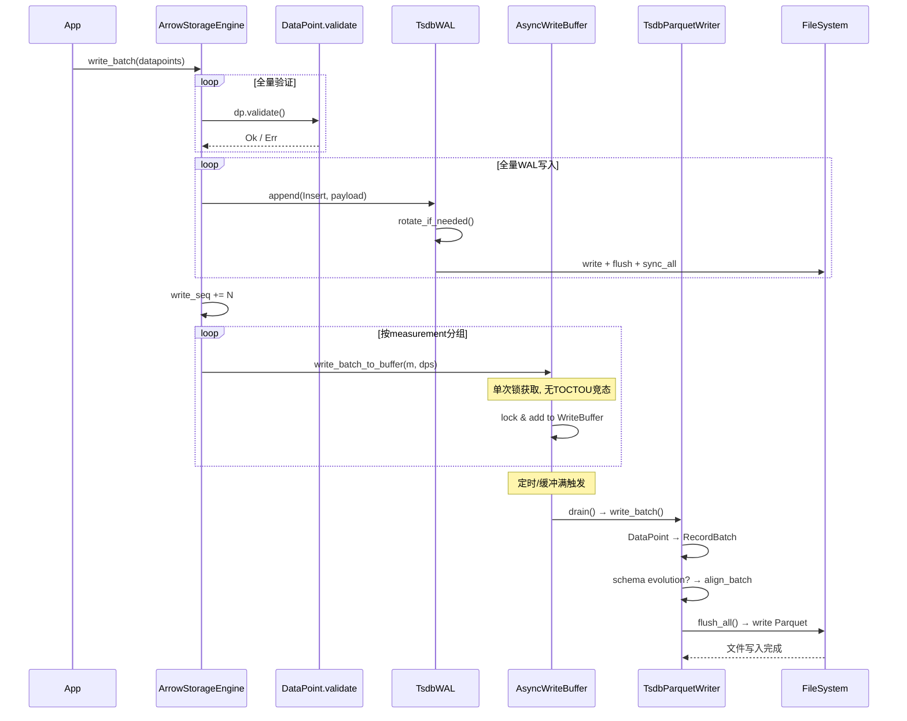
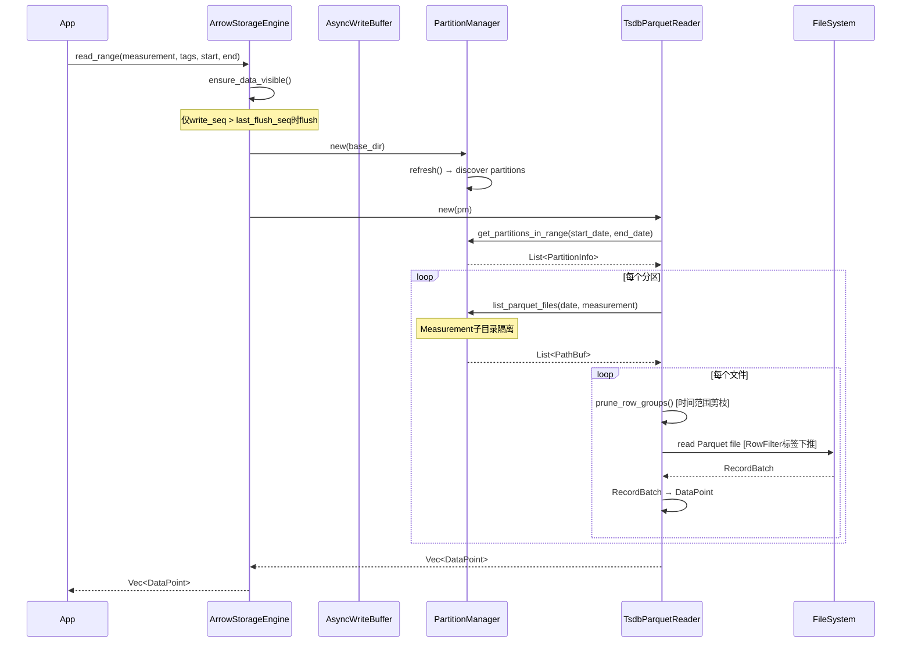
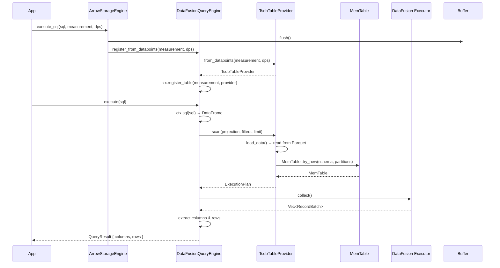
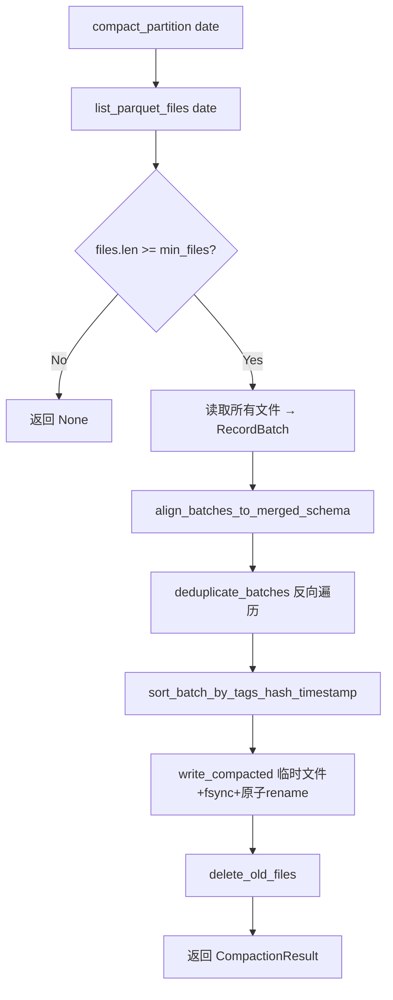
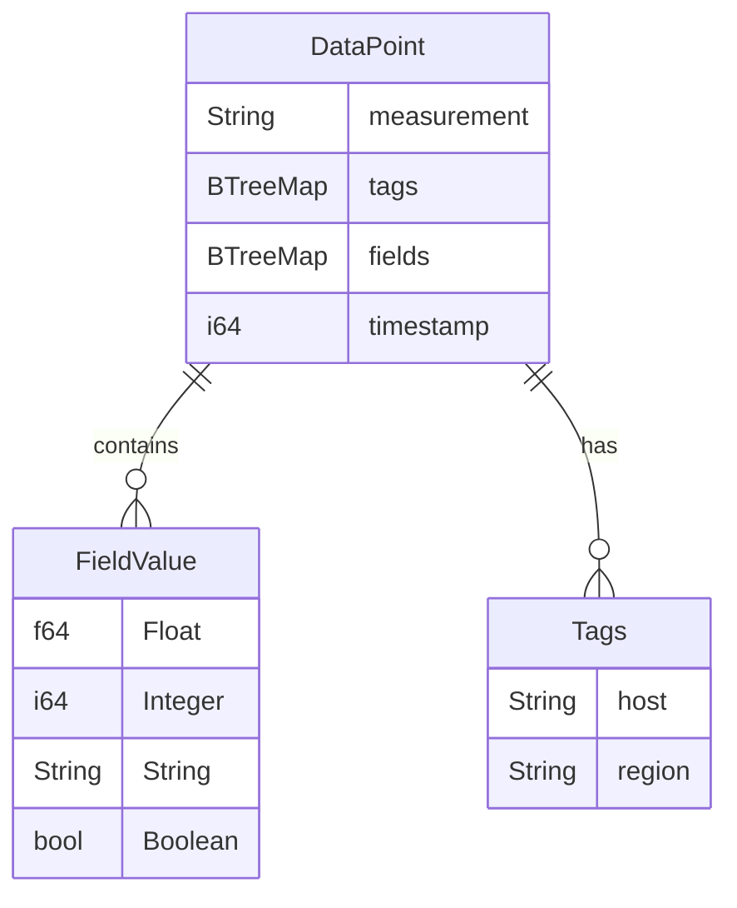

# tsdb2 技术架构文档

## 1. 系统架构图

```
┌──────────────────────────────────────────────────┐
│                 Application                       │
├──────────────────────────────────────────────────┤
│           ArrowStorageEngine (统一入口)            │
│  ┌──────────┬──────────────┬──────────────────┐  │
│  │  write() │  read_range()│  execute_sql()   │  │
│  └────┬─────┴──────┬───────┴────────┬─────────┘  │
├───────┼────────────┼────────────────┼────────────┤
│       ▼            ▼                ▼            │
│  ┌─────────┐  ┌──────────┐  ┌───────────────┐   │
│  │AsyncBuf │  │ Parquet  │  │ DataFusion    │   │
│  │ + WAL   │  │ Reader   │  │ Engine        │   │
│  └────┬────┘  └────┬─────┘  └───────┬───────┘   │
│       ▼            ▼                ▼            │
│  ┌─────────┐  ┌──────────┐  ┌───────────────┐   │
│  │ Parquet │  │ Partition│  │ TableProvider │   │
│  │ Writer  │  │ Manager  │  │ + UDF         │   │
│  └─────────┘  └──────────┘  └───────────────┘   │
├──────────────────────────────────────────────────┤
│              tsdb-arrow (数据模型)                 │
│  DataPoint | FieldValue | Schema | Converter     │
├──────────────────────────────────────────────────┤
│         Arrow | Parquet | DataFusion             │
└──────────────────────────────────────────────────┘
```

## 1.1 Arrow 存储引擎架构

```
┌──────────────────────────────────────────────────────────────────────┐
│                    ArrowStorageEngine                                 │
├──────────────────────────────────────────────────────────────────────┤
│  写入 API (原子操作, 单次锁获取)                                       │
│  ┌──────────┬──────────────────────────────────────────────────┐     │
│  │ write()  │ validate → WAL → write_to_buffer (单次锁)        │     │
│  │write_batch│ 全量validate → 全量WAL → 按measurement分组写buffer│     │
│  └──────────┴──────────────────────────────────────────────────┘     │
├──────────────────────────────────────────────────────────────────────┤
│  读取 API (ensure_data_visible: 仅write_seq>flush_seq时flush)        │
│  ┌──────────┬──────────────┬──────────────┬──────────────────┐      │
│  │read_range│ get_point()  │read_range_   │ execute_sql()    │      │
│  │范围查询   │ 精确点查+    │arrow()       │ DataFusion SQL   │      │
│  │          │ 提前退出     │Arrow格式     │                  │      │
│  └──────────┴──────────────┴──────────────┴──────────────────┘      │
├──────────────────────────────────────────────────────────────────────┤
│  生命周期 API                                                        │
│  ┌──────────┬──────────────┬──────────────┬──────────────────┐      │
│  │ flush()  │ compact()    │ cleanup()    │ list_measurements│      │
│  │全量flush │ 分区压缩     │flush+过期清理│ 列出measurements │      │
│  │+WAL trunc│ L0→L1→L2    │+stale writer │                  │      │
│  └──────────┴──────────────┴──────────────┴──────────────────┘      │
├──────────────────────────────────────────────────────────────────────┤
│  核心组件                                                            │
│  ┌──────────────┐  ┌──────────────┐  ┌──────────────────────────┐  │
│  │  TsdbWAL     │  │AsyncWriteBuf │  │  TsdbParquetWriter       │  │
│  │ 段文件轮转   │  │ 后台定时flush│  │ Schema Evolution(延迟)   │  │
│  │ 64MB/段     │  │ write_seq    │  │ align_batch_to_schema    │  │
│  │ CRC32校验   │  │ 追踪         │  │ sort+dedup+flush         │  │
│  │ 多段recover │  │              │  │                          │  │
│  └──────────────┘  └──────────────┘  └──────────────────────────┘  │
│  ┌──────────────┐  ┌──────────────┐  ┌──────────────────────────┐  │
│  │PartitionMgr  │  │TsdbParquetRdr│  │  ParquetCompactor        │  │
│  │data_YYYYMMDD │  │ Measurement  │  │ 临时文件+fsync+原子rename│  │
│  │  /measurement│  │ 子目录隔离   │  │ 反向遍历去重             │  │
│  │ 过期清理     │  │ RowGroup剪枝 │  │ Schema合并+null填充      │  │
│  └──────────────┘  │ RowFilter下推│  └──────────────────────────┘  │
│                    └──────────────┘                                  │
├──────────────────────────────────────────────────────────────────────┤
│  目录结构                                                            │
│  data_YYYYMMDD/measurement/*.parquet  ← 热数据                      │
│  warm/data_YYYYMMDD/measurement/      ← 温数据 (SNAPPY)             │
│  cold/data_YYYYMMDD/measurement/      ← 冷数据 (ZSTD)               │
│  archive/data_YYYYMMDD/measurement/   ← 归档 (ZSTD)                 │
│  wal/wal-NNNNNN.log                   ← WAL段文件                   │
└──────────────────────────────────────────────────────────────────────┘
```

## 1.2 RocksDB 引擎架构

```
┌──────────────────────────────────────────────────────────────┐
│                    TsdbRocksDb                                │
├──────────────────────────────────────────────────────────────┤
│  写入 API                                                     │
│  ┌──────────┬──────────────┬──────────────────────────┐      │
│  │ put()    │ merge()      │ write_batch()             │      │
│  │ 单点写入  │ 字段合并写入  │ 批量写入 (Tags 去重优化)   │      │
│  └────┬─────┴──────┬───────┴────────────┬─────────────┘      │
├───────┼────────────┼────────────────────┼───────────────────┤
│  读取 API                                                     │
│  ┌──────────┬──────────────┬──────────────┬────────────┐    │
│  │ get()    │ multi_get()  │ read_range() │prefix_scan │    │
│  │ 单点查询  │ 批量点查(3x) │ 范围查询      │ 前缀扫描   │    │
│  └──────────┴──────────────┴──────────────┴────────────┘    │
├──────────────────────────────────────────────────────────────┤
│  管理 API                                                     │
│  ┌──────────┬──────────────┬──────────────┬────────────┐    │
│  │ compact  │ drop_cf      │ snapshot()   │ doctor     │    │
│  │ 压缩     │ 删除CF       │ 一致性快照    │ 健康检查   │    │
│  └──────────┴──────────────┴──────────────┴────────────┘    │
├──────────────────────────────────────────────────────────────┤
│  Column Family 架构                                           │
│  ┌──────────────────────────────────────────────────────┐    │
│  │ _series_meta: tags_hash → tags 映射 (全局唯一)        │    │
│  │ ts_cpu_20260418: Key=hash+ts, Val=fields (按日分区)   │    │
│  │ ts_cpu_20260419: Key=hash+ts, Val=fields              │    │
│  │ ts_memory_20260419: Key=hash+ts, Val=fields           │    │
│  └──────────────────────────────────────────────────────┘    │
├──────────────────────────────────────────────────────────────┤
│  RocksDB 内部                                                 │
│  ┌─────────┐ ┌──────────┐ ┌──────────┐ ┌──────────────┐    │
│  │MemTable │ │L0 SST    │ │L1+ SST   │ │ Block Cache  │    │
│  │(内存)    │ │(无序)     │ │(有序)     │ │ (LRU 32MB)  │    │
│  └─────────┘ └──────────┘ └──────────┘ └──────────────┘    │
│  ┌──────────────────────────────────────────────────────┐    │
│  │ WAL (预写日志) | Bloom Filter | CompactionFilter     │    │
│  └──────────────────────────────────────────────────────┘    │
└──────────────────────────────────────────────────────────────┘
```

## 2. 类图

### tsdb-arrow

```
┌──────────────────────┐
│      DataPoint       │
├──────────────────────┤
│ measurement: String  │
│ tags: BTreeMap       │
│ fields: BTreeMap     │
│ timestamp: i64       │
├──────────────────────┤
│ + new()              │
│ + with_tag()         │
│ + with_field()       │
│ + series_key()       │
└──────────────────────┘
         │
         ▼
┌──────────────────────┐
│     FieldValue       │
├──────────────────────┤
│ Float(f64)           │
│ Integer(i64)         │
│ String(String)       │
│ Boolean(bool)        │
├──────────────────────┤
│ + as_f64()           │
│ + as_i64()           │
│ + as_str()           │
│ + as_bool()          │
└──────────────────────┘

┌──────────────────────┐
│  TsdbSchemaBuilder   │
├──────────────────────┤
│ + new(measurement)   │
│ + with_tag_key()     │
│ + with_float_field() │
│ + with_int_field()   │
│ + with_string_field()│
│ + with_bool_field()  │
│ + compact()          │
│ + build() → SchemaRef│
└──────────────────────┘

┌──────────────────────┐
│   TsdbMemoryPool     │
├──────────────────────┤
│ + new(limit)         │
│ + allocate(n)        │
│ + release(n)         │
│ + used() → usize     │
│ + available() → usize│
└──────────────────────┘
```

### tsdb-rocksdb

```
┌──────────────────────────────────────────────────────┐
│                    TsdbRocksDb                        │
├──────────────────────────────────────────────────────┤
│ - db: DB                                             │
│ - config: RocksDbConfig                              │
│ - cache: Cache                                       │
│ - base_dir: PathBuf                                  │
├──────────────────────────────────────────────────────┤
│ + open(path, config) → Result<Self>                  │
│ + put(measurement, tags, ts, fields) → Result        │
│ + merge(measurement, tags, ts, fields) → Result      │
│ + write_batch(dps) → Result             [Tags 去重]  │
│ + get(measurement, tags, ts) → Result<Option<DP>>    │
│ + multi_get(measurement, keys) → Result<Vec<Option>> [批量点查] │
│ + read_range(measurement, start, end) → Result<Vec>  │
│ + prefix_scan(measurement, tags, start, end)         │
│ + snapshot() → TsdbSnapshot                          │
│ + drop_cf(cf_name) → Result                         │
│ + compact_cf(cf_name) → Result                      │
│ + list_ts_cfs() → Vec<String>                       │
│ + stats() → String                                  │
│ + cf_stats(cf_name) → Option<String>                │
└──────────────────────────────────────────────────────┘

┌──────────────────────┐     ┌──────────────────────┐
│      TsdbKey         │     │    RocksDbConfig     │
├──────────────────────┤     ├──────────────────────┤
│ tags_hash: u64       │     │ cache_size: usize    │
│ timestamp: i64       │     │ cf_write_buffer_size │
├──────────────────────┤     │ cf_max_bytes_level   │
│ + new() → Self       │     │ default_ttl_secs     │
│ + encode() → Vec<u8> │     └──────────────────────┘
│ + decode() → Result  │
│ + prefix_encode()    │
└──────────────────────┘
```

### tsdb-parquet

```
┌──────────────────────┐     ┌──────────────────────┐
│  TsdbParquetWriter   │     │  TsdbParquetReader   │
├──────────────────────┤     ├──────────────────────┤
│ - partition_manager  │     │ - partition_manager  │
│ - config             │     ├──────────────────────┤
│ - buffers            │     │ + new(pm)            │
│ - schema             │     │ + read_range()       │
├──────────────────────┤     │ + read_range_arrow() │
│ + new(pm, config)    │     │ + read_range_arrow   │
│ + write(dp)          │     │   _with_filters()    │
│ + write_batch(dps)   │     │ + get_point()        │
│ + flush_all()        │     │ + read_parquet_file  │
│ [tags_hash 自动计算] │     │   _with_pruning()    │
│ [排序后写入]         │     │ + read_all_datapoints│
└──────────────────────┘     │ [Row Group 剪枝]     │
                             │ [标签行级过滤]       │
┌──────────────────────┐     └──────────────────────┘
│  PartitionManager    │
├──────────────────────┤     ┌──────────────────────┐
│ - base_dir           │     │      TsdbWAL         │
│ - config             │     ├──────────────────────┤
│ - known_partitions   │     │ - path               │
├──────────────────────┤     │ - file               │
│ + new(dir, config)   │     │ - sequence           │
│ + refresh()          │     ├──────────────────────┤
│ + ensure_partition() │     │ + create(path)       │
│ + get_partitions()   │     │ + append(type, data) │
│ + cleanup_expired()  │     │ + sync()             │
│ + list_parquet_files │     │ + recover(path)      │
└──────────────────────┘     └──────────────────────┘

┌──────────────────────┐     ┌──────────────────────┐
│   ParquetCompactor   │     │   PartitionManifest  │
├──────────────────────┤     ├──────────────────────┤
│ + new(pm, config)    │     │ - measurement        │
│ + compact_partition()│     │ - date               │
│ + compact_all()      │     │ - tier               │
│ [tags_hash 去重]     │     │ - files: Vec<FileStat│
│ [tag 列回退去重]     │     ├──────────────────────┤
└──────────────────────┘     │ + add_file()         │
                             │ + remove_file()      │
┌──────────────────────┐     │ + files_in_time_range│
│     FileStats        │     │ + write()/read()     │
├──────────────────────┤     └──────────────────────┘
│ + file_path          │
│ + timestamp_min: Opt │     ┌──────────────────────┐
│ + timestamp_max: Opt │     │   pruning 模块       │
│ + tags_hash_min: Opt │     ├──────────────────────┤
│ + tags_hash_max: Opt │     │ + prune_files()      │
│ + tag_values: HashMap│     │ + prune_files_by_time│
│ [Option 类型安全]    │     │ + prune_files_by_tags│
└──────────────────────┘     │ + prune_row_groups() │
                             └──────────────────────┘
```

### tsdb-datafusion

```
┌──────────────────────┐     ┌──────────────────────┐
│ DataFusionQueryEngine│     │  TsdbTableProvider   │
├──────────────────────┤     ├──────────────────────┤
│ - ctx: SessionContext│     │ - schema: SchemaRef  │
│ - base_dir: PathBuf  │     │ - measurement: String│
├──────────────────────┤     │ - base_dir: PathBuf  │
│ + new(base_dir)      │     ├──────────────────────┤
│ + register_measure() │     │ + new(name, schema)  │
│ + register_from_dp() │     │ + from_datapoints()  │
│ + execute(sql)       │     │ + scan() [TableProv] │
│ + execute_arrow(sql) │     └──────────────────────┘
└──────────────────────┘

┌──────────────────────┐
│   time_bucket UDF    │
├──────────────────────┤
│ time_bucket(ts, int) │
│ → Timestamp bucketed │
└──────────────────────┘
```

### tsdb-storage-arrow

```
┌──────────────────────────┐     ┌──────────────────────┐
│ ArrowStorageEngine       │     │   WriteBuffer        │
├──────────────────────────┤     ├──────────────────────┤
│ - partition_manager      │     │ - buffers: BTreeMap  │
│ - _reader                │     │ - max_buffer_rows    │
│ - compactor              │     │ - total_rows         │
│ - wal: Option<TsdbWAL>   │     ├──────────────────────┤
│ - async_writers: Mutex   │     │ + new(max_rows)      │
│ - writer_config          │     │ + write(dp)          │
│ - query_engine           │     │ + write_batch(dps)   │
│ - _config                │     │ + drain()            │
│ - _base_dir              │     │ + total_rows()       │
│ - known_measurements     │     └──────────────────────┘
│ - write_seq: AtomicU64   │
│ - last_flush_seq:AtmU64  │     ┌──────────────────────┐
├──────────────────────────┤     │  AsyncWriteBuffer    │
│ + open(path, config)     │     ├──────────────────────┤
│ + write(dp) [原子锁]     │     │ - inner: Mutex<Buf>  │
│ + write_batch(dps)       │     │ - writer: Mutex<Wr>  │
│   [全量validate→WAL→buf] │     │ - handle: JoinHandle │
│ + read_range()           │     ├──────────────────────┤
│ + get_point() [精确+退出]│     │ + new(writer, config)│
│ + read_range_arrow()     │     │ + write(dp)          │
│ + execute_sql()          │     │ + write_batch(dps)   │
│ + ensure_data_visible()  │     │ + flush()            │
│   [write_seq>flush_seq]  │     │ + stop()             │
│ + flush() [WAL trunc]    │     └──────────────────────┘
│ + compact()              │
│ + cleanup() [flush+stale]│
│ + list_measurements()    │
└──────────────────────────┘
```

### tsdb-parquet WAL (段文件轮转)

```
┌──────────────────────────┐
│        TsdbWAL            │
├──────────────────────────┤
│ - dir: PathBuf            │
│ - current_path: RwLock    │
│ - segment_seq: AtomicU64  │
│ - sequence: AtomicU64     │
│ - writer: Mutex<BufWriter>│
│ - max_file_size: u64      │
│ - current_size: AtomicU64 │
├──────────────────────────┤
│ + create(path)            │
│ + with_max_file_size(u64) │
│ + append(type, payload)   │
│   [rotate_if_needed]      │
│ + sync()                  │
│ + truncate()              │
│   [清理旧段文件]          │
│ + recover(path)           │
│   [扫描所有wal-*.log段]   │
│ + path()                  │
│ - rotate_if_needed()      │
│   [64MB自动轮转]          │
└──────────────────────────┘
```

## 3. 写入流程时序图



## 4. 读取流程时序图



## 5. SQL 查询时序图



## 6. Compaction 流程图



## 7. 数据模型 ER 图



## 8. Schema 模式

### Extended Schema

```
| timestamp | measurement | tags_hash | tag_keys | tag_values | usage | idle | count |
```

适用于 tag key 不固定的场景，所有 tag 存储为列表。

### Compact Schema

```
| timestamp | tag_host | tag_region | usage | idle | count |
```

适用于 tag key 固定的场景，每个 tag 作为独立列，查询性能更优。
